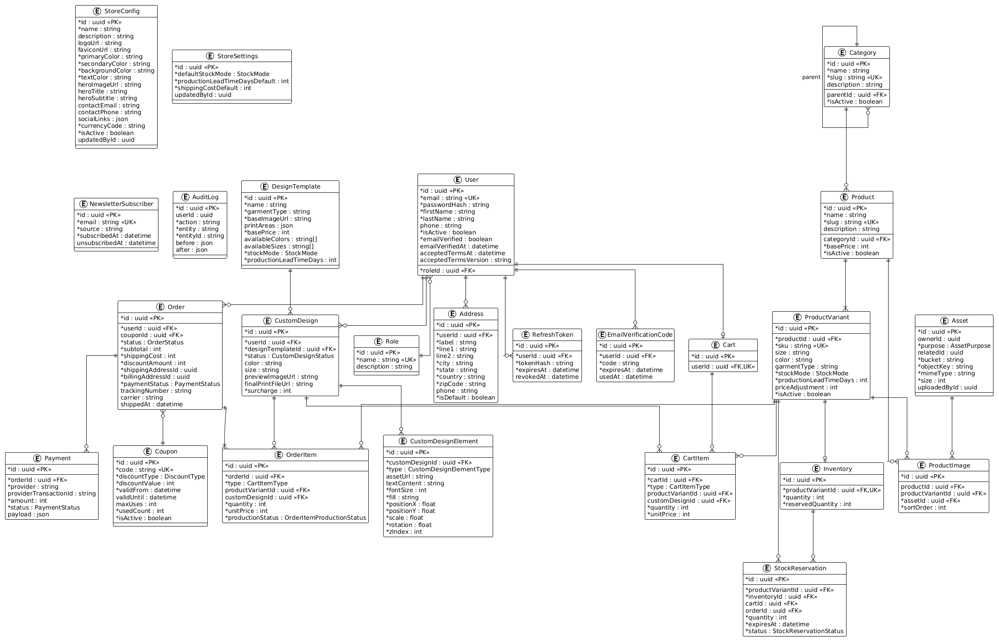

# Modelo Entidad-Relación (ER)

Este documento describe el modelo de datos actual de la plataforma, generado a partir de `apps/api/prisma/schema.prisma`.

## Diagrama



> La imagen se genera desde `docs/er-diagram.puml` usando el servidor público de PlantUML. Ver la sección [Regenerar el diagrama](#regenerar-el-diagrama) al final.

## Convenciones

- Las claves primarias se indican con `<<PK>>`.
- Las claves únicas se indican con `<<UK>>`.
- Las claves foráneas se indican con `<<FK>>`.
- Un asterisco (`*`) delante de un campo significa que es obligatorio (`NOT NULL`).
- Los campos sin asterisco son opcionales (`NULL`).

## Entidades principales

### Autenticación y usuarios

| Entidad | Descripción |
|---------|-------------|
| `User` | Cuentas de cliente y administrador. Incluye datos de contacto, flags de verificación, consentimiento de términos y rol. |
| `Role` | Roles del sistema (`CUSTOMER`, `ADMIN`). |
| `RefreshToken` | Tokens de refresco rotativos para sesiones JWT. |
| `EmailVerificationCode` | Códigos OTP de 6 dígitos para verificación de email. |
| `Address` | Direcciones de envío/facturación asociadas a un usuario. |

### Configuración y marketing

| Entidad | Descripción |
|---------|-------------|
| `StoreConfig` | Configuración pública de la tienda: nombre, colores, moneda, contacto, redes sociales, hero, etc. |
| `StoreSettings` | Configuración operativa: modo de stock por defecto, lead time y costo de envío por defecto. |
| `NewsletterSubscriber` | Suscriptores del newsletter, con fecha de alta/baja. |
| `AuditLog` | Registro de acciones administrativas relevantes (cambios de stock, modo de stock, etc.). |

### Catálogo

| Entidad | Descripción |
|---------|-------------|
| `Category` | Categorías de productos, con soporte de jerarquía (`parentId`). |
| `Product` | Productos base con nombre, slug, descripción, precio base y categoría. |
| `ProductVariant` | Variantes de un producto (talla, color, SKU, modo de stock, lead time, ajuste de precio). |
| `Inventory` | Stock disponible y reservado de una variante (solo para variantes `TRACKED`). |
| `ProductImage` | Asociación entre productos/variantes y assets visuales, con orden de visualización. |
| `Asset` | Metadatos de archivos subidos (imágenes de catálogo, assets de personalización, archivos de impresión). |

### Stock

| Entidad | Descripción |
|---------|-------------|
| `StockReservation` | Reservas temporales de stock vinculadas a un carrito u orden. Permite liberar o comprometer unidades. |

### Personalización

| Entidad | Descripción |
|---------|-------------|
| `DesignTemplate` | Plantillas base para diseños personalizados (imagen base, áreas de impresión, tallas/colores disponibles). |
| `CustomDesign` | Diseño creado por un usuario a partir de una plantilla, con color, talla, recargo y estado de revisión. |
| `CustomDesignElement` | Elementos visuales de un diseño: imágenes subidas, texto y cliparts, con posición, escala, rotación y orden de capas. |

### Carrito

| Entidad | Descripción |
|---------|-------------|
| `Cart` | Carrito de compras, opcionalmente vinculado a un usuario autenticado. |
| `CartItem` | Línea de carrito. Puede ser un ítem estándar (`STANDARD`) o un diseño personalizado (`CUSTOM`). |

### Pedidos y pagos

| Entidad | Descripción |
|---------|-------------|
| `Order` | Pedido generado desde el checkout. Incluye estados de orden y pago, costos, direcciones y tracking de envío. |
| `OrderItem` | Líneas de un pedido. Guardan el tipo, cantidad, precio unitario y estado de producción. |
| `Payment` | Intentos/registros de pago asociados a una orden. |
| `Coupon` | Cupones de descuento con tipo, valor, vigencia, usos máximos y contador de usos. |

## Relaciones clave

| Origen | Cardinalidad | Destino | Significado |
|--------|--------------|---------|-------------|
| `User` | 1:N | `Address` | Un usuario puede tener varias direcciones. |
| `Role` | 1:N | `User` | Un rol puede tener muchos usuarios. |
| `User` | 1:N | `RefreshToken` | Rotación de tokens de sesión. |
| `User` | 1:N | `EmailVerificationCode` | Códigos de verificación de email. |
| `User` | 1:1 (opcional) | `Cart` | Cada usuario autenticado tiene un carrito. |
| `User` | 1:N | `Order` | Historial de pedidos del usuario. |
| `User` | 1:N | `CustomDesign` | Diseños creados por el usuario. |
| `Category` | 1:N (auto) | `Category` | Subcategorías. |
| `Category` | 1:N | `Product` | Productos dentro de una categoría. |
| `Product` | 1:N | `ProductVariant` | Variantes de un producto. |
| `ProductVariant` | 1:1 (opcional) | `Inventory` | Control de stock de una variante. |
| `ProductVariant` | 1:N | `StockReservation` | Reservas de stock de una variante. |
| `Inventory` | 1:N | `StockReservation` | Reservas asociadas a un inventario. |
| `Asset` | 1:N | `ProductImage` | Assets usados como imágenes de producto. |
| `Product` / `ProductVariant` | 1:N | `ProductImage` | Imágenes de un producto o variante. |
| `ProductVariant` | 1:N | `CartItem` | Ítems de carrito estándar. |
| `CustomDesign` | 1:N | `CartItem` | Ítems de carrito personalizados. |
| `Cart` | 1:N | `CartItem` | Contenido del carrito. |
| `DesignTemplate` | 1:N | `CustomDesign` | Diseños basados en una plantilla. |
| `CustomDesign` | 1:N | `CustomDesignElement` | Elementos visuales del diseño. |
| `Order` | 1:N | `OrderItem` | Líneas de un pedido. |
| `ProductVariant` | 1:N (opcional) | `OrderItem` | Ítems de pedido estándar. |
| `CustomDesign` | 1:N (opcional) | `OrderItem` | Ítems de pedido personalizados. |
| `Order` | 1:N | `Payment` | Pagos asociados a una orden. |
| `Coupon` | 1:N (opcional) | `Order` | Cupón aplicado a pedidos. |

## Notas sobre campos no representados como relaciones

- `Order.shippingAddressId` y `Order.billingAddressId` referencian `Address.id`, pero en Prisma se manejan como campos `uuid` sin relación explícita. La validez de las direcciones se garantiza en la lógica de aplicación.
- `AuditLog.userId` referencia al usuario que realizó la acción, también sin relación explícita en Prisma.
- `StoreConfig.updatedById` y `StoreSettings.updatedById` referencian `User.id` sin relación explícita.
- `Asset.ownerId`, `Asset.relatedId` y `Asset.uploadedById` son campos libres para trazabilidad sin relaciones forzadas en Prisma.

## Enums del modelo

```
StockMode
  - MADE_TO_ORDER
  - TRACKED

StockReservationStatus
  - ACTIVE
  - RELEASED
  - COMMITTED

CustomDesignStatus
  - DRAFT
  - PENDING_REVIEW
  - APPROVED
  - REJECTED

CustomDesignElementType
  - UPLOADED_IMAGE
  - TEXT
  - CLIPART

CartItemType
  - STANDARD
  - CUSTOM

OrderStatus
  - PENDING_PAYMENT
  - PAID
  - IN_PRODUCTION
  - READY_TO_SHIP
  - SHIPPED
  - DELIVERED
  - CANCELLED
  - REFUNDED

PaymentStatus
  - PENDING
  - AUTHORIZED
  - PAID
  - FAILED
  - REFUNDED

OrderItemProductionStatus
  - PENDING_PRODUCTION
  - IN_PRODUCTION
  - QUALITY_CHECK
  - READY_TO_SHIP

AssetPurpose
  - CATALOG_IMAGE
  - CUSTOM_DESIGN_ASSET
  - PRINT_FILE

DiscountType
  - PERCENTAGE
  - FIXED
```

## Regenerar el diagrama

1. Editar `docs/er-diagram.puml` si cambia el schema.
2. Renderizar con PlantUML:
   ```bash
   # Opción A: servidor público (sin instalar nada)
   python docs/generate_er.py

   # Opción B: CLI local de PlantUML
   java -jar plantuml.jar docs/er-diagram.puml
   ```
3. Verificar que se haya actualizado `docs/er-diagram.png`.
